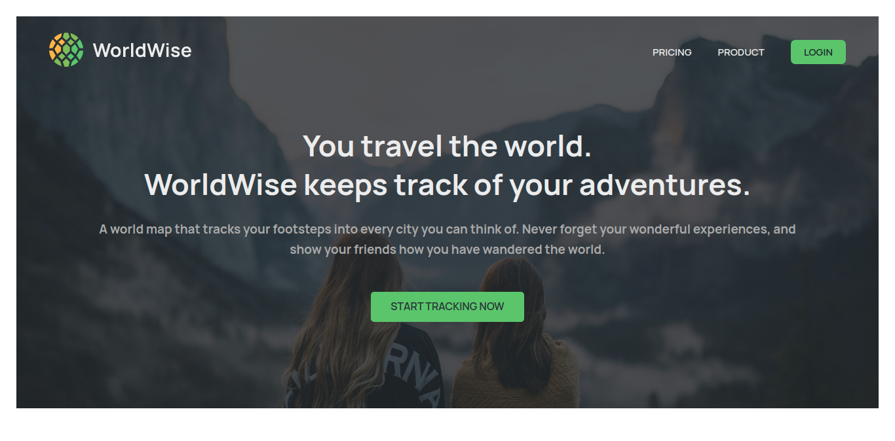
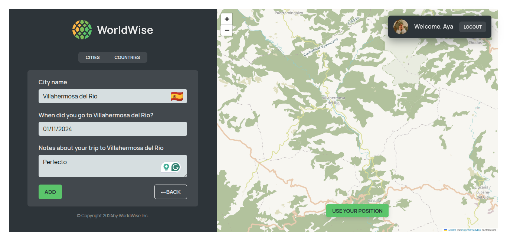

# 🌍 WorldWise

Welcome to **WorldWise**! This project helps you stay globally connected by tracking countries, their details, and more. 🌐

## 🚀 Features

- 🌎 **Browse Global Data**: Discover countries worldwide with key details like population, area, and location.
- 🔍 **Track Locations**: Follow your favorite places and keep up-to-date with insightful information.
- 📈 **Real-time Insights**: Get accurate data visualizations to understand global dynamics.

## 📸 Screenshots

### 🏠 Home Page



### 🚶 Tracking Page



## 🛠️ Technologies

- **React** ⚛️
- **Node.js** 🟢
- **Express** 🚀
- **MongoDB** 🍃

## 📂 Project Structure

```
WorldWise/
├── public/
│   ├── home.png
│   ├── tracking.png
├── src/
│   ├── components/
│   ├── pages/
│   ├── utils/
└── README.md
```

## 📣 How to Get Started

1. **Clone the Repo**: `git clone https://github.com/ayaa5aly/WorldWise`
2. **Install Dependencies**: `npm install`
3. **Run the App**: `npm start`

## 🤝 Contributing

Feel free to submit issues or pull requests to help improve **WorldWise**!
